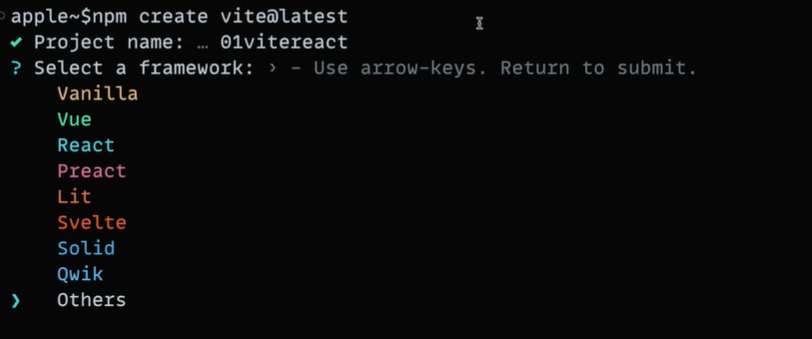

# ws_react

React apps are made out of components. A component is a piece of the UI (user interface) that has its own logic and appearance. A component can be as small as a button, or as large as an entire page.

React components are JavaScript functions that return markup:

```javascript
function MyButton() {
  return <button>I'm a button</button>;
}
```

REACT is a framework

node-package-executor npx is the most basic way to create a react app
create-react-app -is a utility but it is very bulky, prefer Vite or Parcel instead.

## Directory structure

package.json - This file contains all required libraries along with version
<br>

## to start app

```shell
npm run start
```

## to build before deploying to prod

```shell
npm run build
```

## to create react app using vite

```shell
npm create vite@latest
```

Enter Project Name and select framework


Install node modules if not present in project dir

```shell
npm install
```

Run via vite

```shell
npm run dev
```
